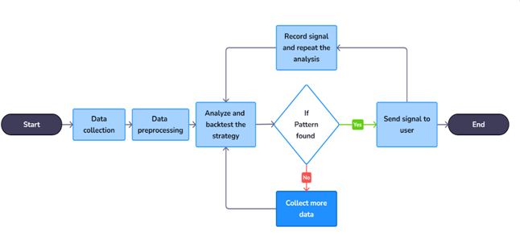
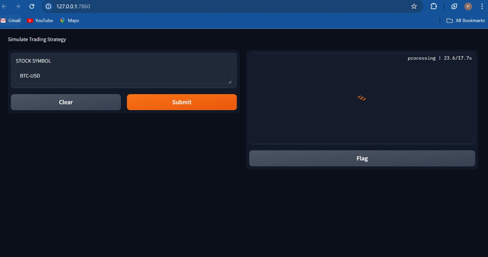
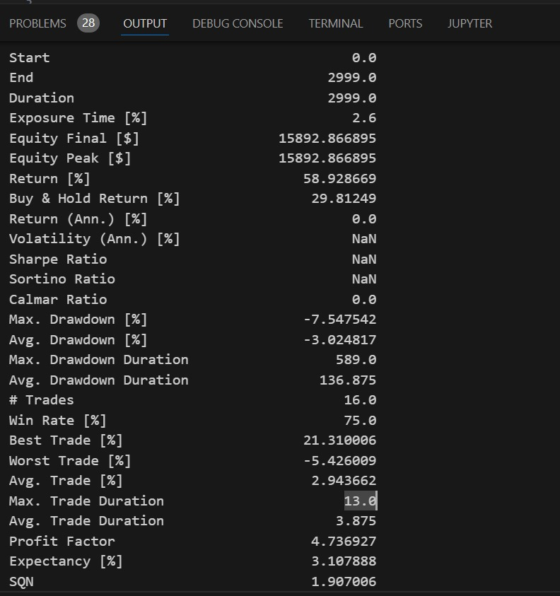
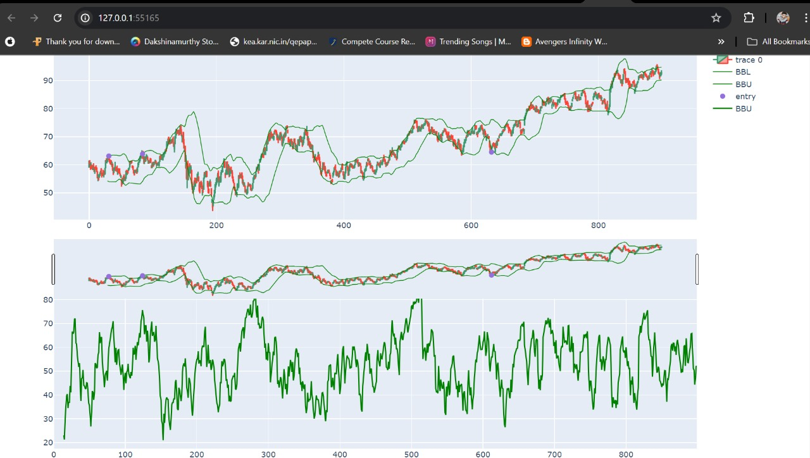
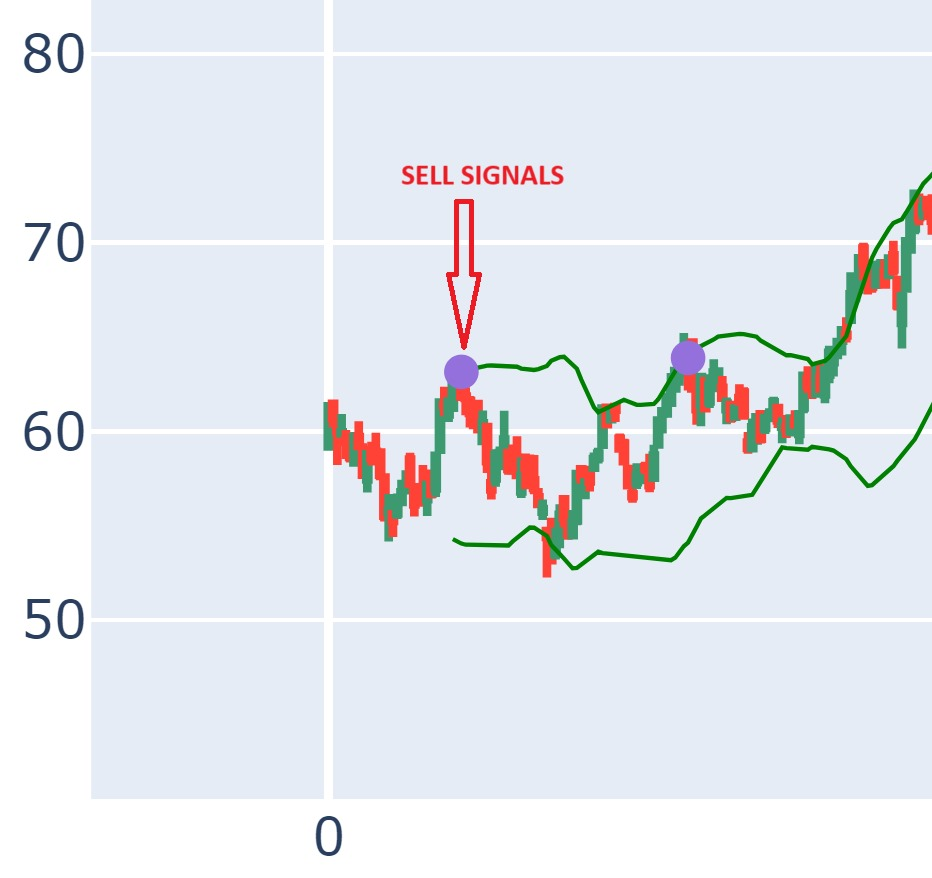
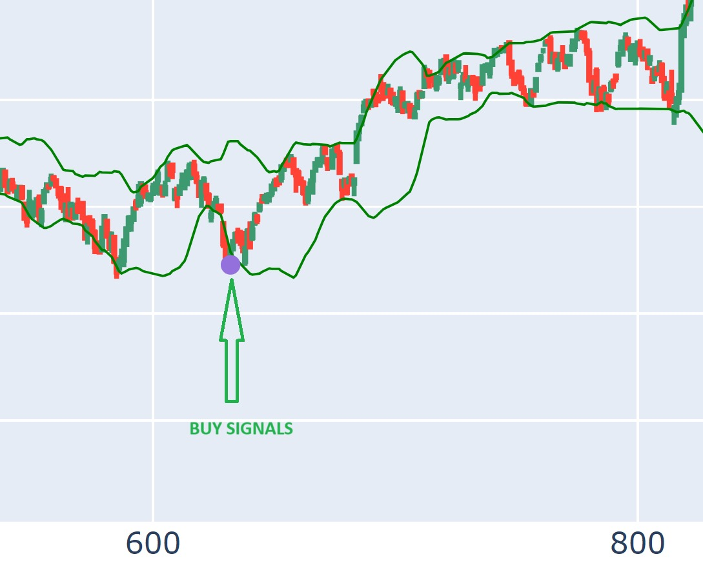

# Hack2skill_trading_system
 by team AnalyticAlliance

## Overview

The "hack2skill_trading_system" is an innovative algorithmic trading solution designed to harness the power of artificial intelligence to optimize trading decisions. The system generates trading signals using technical indicators such as Bollinger Bands and the Relative Strength Index (RSI). By analyzing historical and real-time stock data, it identifies and learns from profitable trading patterns, notifying users promptly to capitalize on potential profit opportunities.

## Uniqueness

What sets the "hack2skill_trading_system" apart from other trading algorithms is its integration of cloud technology for advanced performance and real-time notifications. Unlike traditional trading systems that rely on static algorithms, our system evolves by learning from new data, thereby improving its predictive accuracy over time. Additionally, the system’s comprehensive backtesting feature allows users to evaluate multiple trading strategies against historical data, providing detailed profitability statistics and performance summaries.

## Potential Impact

The "hack2skill_trading_system" promises to transform trading practices by making advanced financial tools accessible to a broader audience and delivering significant financial benefits to its users. It enhances trading efficiency and empowers traders with data-driven insights, ensuring informed decisions and maximized profitability.

## Process Flow Diagram/Use Case Diagram

## Screenshots

- **User Interface**  
  
- **Backtesting Results**  
  
- **Overall Signals**  
  
- **Sell Signal**  
  
- **Buy Signal**  
  

## Process Flow

1. **Data Collection:** The system gathers historical and real-time stock data from reliable financial data providers.
2. **Data Preprocessing:** The collected data is cleaned, formatted, and stored for analysis.
3. **Data Analysis:** Bollinger Bands and RSI indicators are applied to the preprocessed data to identify trading signals.
4. **Pattern Recognition:** Algorithms analyze the data to detect recurring patterns and predict future price movements.
5. **Signal Generation:** Based on the detected patterns and analysis, the system generates trading signals.
6. **Backtesting:** The system backtests various trading strategies against historical data to evaluate their performance.
7. **Profitability Analysis:** A comprehensive summary and profitability statistics of each strategy are provided to the user.
8. **User Notification:** The system sends real-time alerts to users about potential trading opportunities based on the identified patterns.

## Technologies Used

- **Artificial Intelligence:** Utilized for sophisticated pattern recognition and predictive analysis, enhancing the system’s ability to identify profitable trading opportunities.
- **Python:** The primary programming language for developing the algorithmic trading system.
- **pandas:** A powerful library for data manipulation and analysis, crucial for handling large datasets.
- **NumPy:** Used for numerical computations and efficient data processing.
- **Plotly:** For creating interactive and visually appealing data visualizations to help users understand market trends and patterns.
- **pandas-ta:** A technical analysis library that provides various indicators like Bollinger Bands and RSI.
- **backtesting.py:** A library for strategy backtesting and performance evaluation, enabling users to assess the effectiveness of their trading strategies.
- **AWS/GCP/Azure:** Cloud platforms used for scalable data processing, storage, and real-time analysis capabilities.

## Conclusion

The "hack2skill_trading_system" exemplifies the integration of technology and finance to push the boundaries of algorithmic trading. Our innovative trading system aims to transform trading practices, making advanced financial tools accessible to a broader audience and delivering significant financial benefits to its users. By enhancing trading efficiency and empowering traders with data-driven insights, the system ensures informed decisions and maximized profitability.

---
